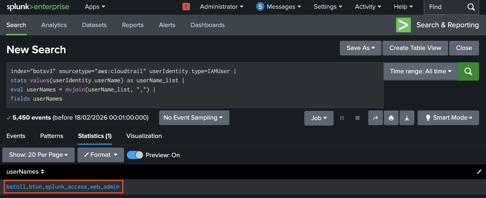
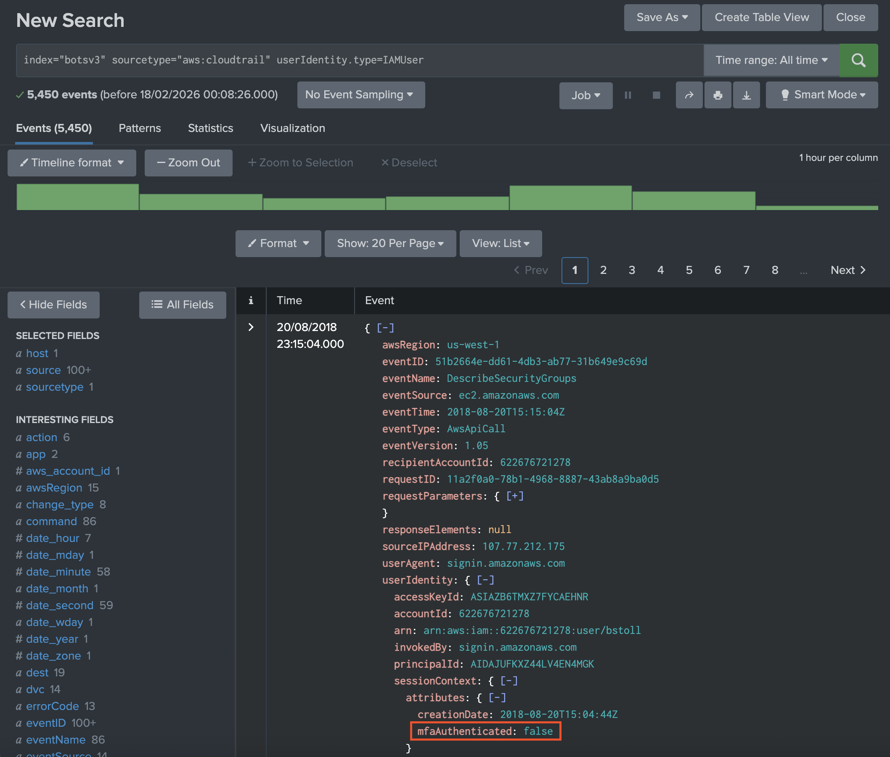
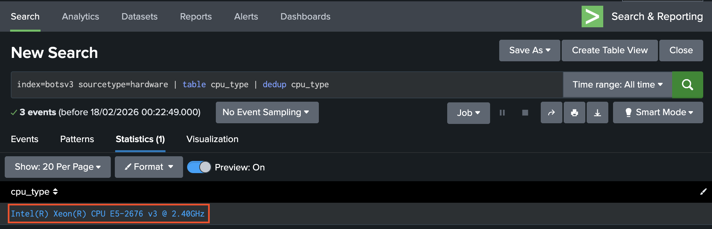
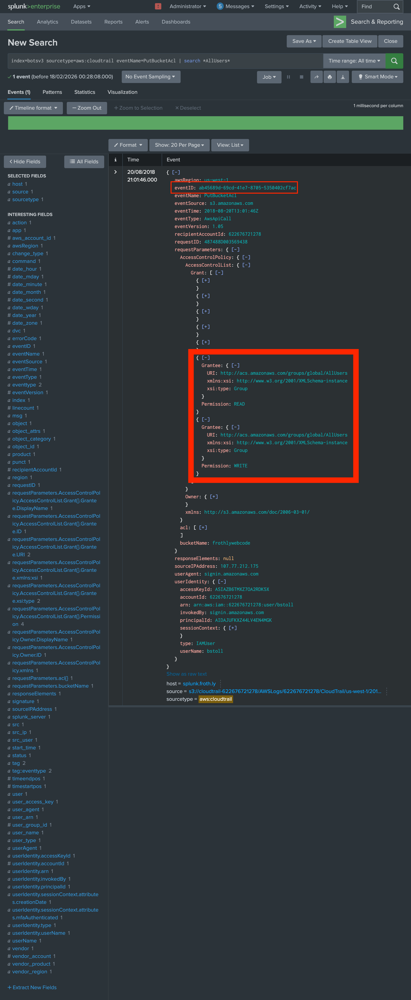
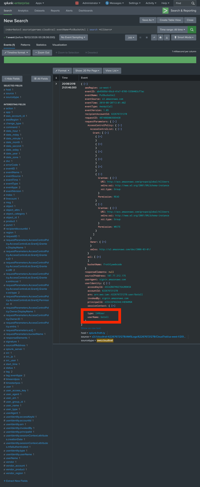
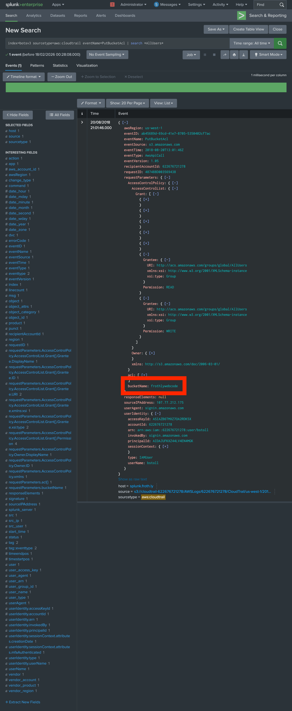
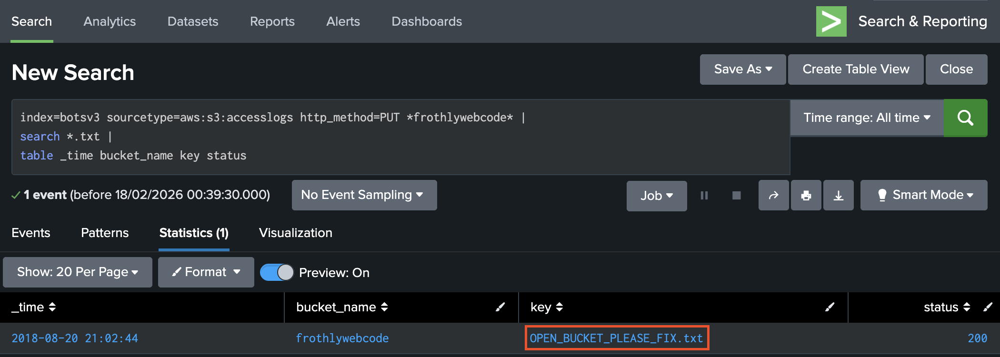
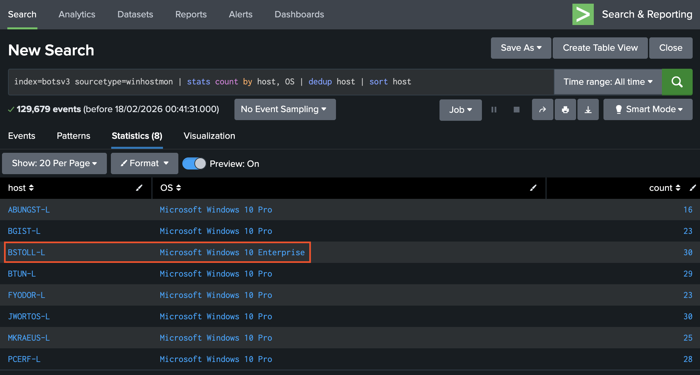
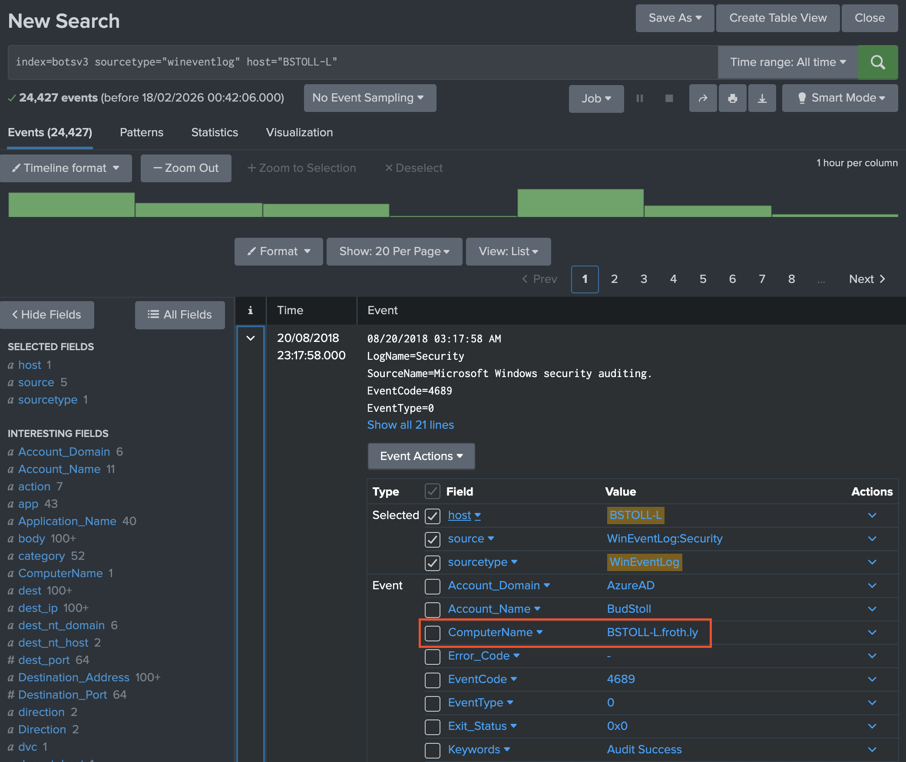

# COMP3010HK Incident Analysis – Boss of the SOC v3 Investigation Report

This report presents a security investigation conducted using Splunk’s Boss of the SOC version 3 (BOTSv3) dataset. BOTSv3 is a publicly available, pre-indexed security dataset and Capture The Flag (CTF) platform created by Splunk to simulate a realistic security incident within a fictitious brewing company, Frothly. The dataset contains network, endpoint, email, and cloud service data from environments such as Amazon AWS and Microsoft Azure, which analysts investigate using Splunk’s Search Processing Language (SPL) in accordance with incident response and kill-chain methodologies.

### Objectives

The objectives of this investigation are to:
- Apply SOC-oriented analysis techniques to identify compromised assets and misconfigurations;
- Answer a defined set of 200-level BOTSv3 questions focused on AWS and endpoint events; and
- Reflect on how SOC roles, tiers, and incident handling practices apply to this exercise.

### Scope and assumptions

The scope is limited to the BOTSv3 dataset ingested into a single Splunk index (`botsv3`) on an Ubuntu VM. The analysis uses the moodle BOTSv3 200-Level quiz set. It is assumed that the dataset has been correctly ingested and that source types such as `aws:cloudtrail`, `aws:s3:accesslogs`, `hardware`, and `winhostmon` are available and populated.

### Report structure

The report is organised as follows:

- SOC roles and incident handling reflection
- Installation and data preparation
- Guided questions
- Conclusion
- Presentation
- References

## SOC Roles and Incident Handling Reflection

This section relates SOC structure and incident-handling phases to the BOTSv3 exercise.

### SOC tiers

Security Operations Centres (SOCs) perform continuous monitoring, detection, and response to security events. SOC tiers typically run from Tier 1 through Tier 2 to Tier 3. Tier 1 focuses on initial triage and alert handling. Tier 2 takes on deeper investigation of events and context. Tier 3 handles advanced threat analysis and escalation.

In the BOTSv3 scenario, the analyst’s work spans all three tiers:

- Tier 1: Triaging AWS and endpoint data.
- Tier 2: Correlating IAM, S3, and host data to understand the incident.
- Tier 3: Drawing conclusions about misconfigurations and exposure.

### Incident phases

Incident handling can be described as prevention, detection, response, and recovery [7]. In BOTSv3:

- **Prevention** — Questions on MFA monitoring and S3 bucket configuration reflect controls that would reduce credential misuse and public data exposure.
- **Detection** — CloudTrail, S3 access logs, and endpoint data (e.g. hardware and OS inventory) mirror the telemetry a SOC uses to spot anomalous API calls, bucket access, or host outliers.
- **Response** — Identifying affected principals (IAM users), resources (the exposed bucket), and endpoints (e.g. the host with a different OS edition) would inform containment and remediation.
- **Recovery** — Revoking exposed credentials, locking down bucket ACLs, and hardening endpoints would be documented in a real post-incident report.

## Installation and Data Preparation

### Environment

Splunk Enterprise was installed on an Ubuntu virtual machine in line with the BOTSv3 documentation. The VM was provisioned with sufficient CPU and memory to support indexing and searching the BOTSv3 dataset. A single-node deployment was used.

### Dataset ingestion

The BOTSv3 dataset was obtained from the official repository (https://github.com/splunk/botsv3). The repository’s instructions were followed to download the data and ingest it into Splunk. Data was indexed under the index name `botsv3` as specified in the BOTSv3 documentation, ensuring compatibility with standard SPL examples and source type names.

### Validation

After ingestion, validation was performed to confirm that the index `botsv3` was populated and that the source types required for this report were present. Searches were run to verify events for `aws:cloudtrail`, `aws:s3:accesslogs`, `hardware`, and `winhostmon`. Screenshots of the index summary and sample source type listings are retained as evidence of a successful setup. This step is important in a SOC context to ensure that data pipelines are functioning before analysts rely on them for investigations.

### Justification

The choice of a single index for BOTSv3 aligns with the dataset’s design and keeps the lab environment simple while still reflecting how a SOC might dedicate an index to a specific data source or exercise.

## Guided Questions

Supporting evidence (screenshots of queries and results) is included in the final submission to demonstrate the analysis performed in Splunk. 

### Question 1

List out the IAM users that accessed an AWS service (successfully or unsuccessfully) in Frothly's AWS environment?

#### SPL

```spl
index="botsv3" sourcetype="aws:cloudtrail" userIdentity.type=IAMUser | 
stats values(userIdentity.userName) as userName_list | 
eval userNames = mvjoin(userName_list, ",") | 
fields userNames
```

#### Answer
bstoll,btun,splunk_access,web_admin

#### Evidence


#### SOC relevance
Enumerating IAM users from CloudTrail [1] establishes a baseline of who can act in the environment and supports access reviews and detection of unauthorised accounts.

---

### Question 2

What field would you use to alert that AWS API activity has occurred without MFA (multi-factor authentication)?

#### Answer
userIdentity.sessionContext.attributes.mfaAuthenticated

#### Evidence


#### SOC relevance
Alerting on this field supports detection of high-risk actions performed without MFA [1].

---

### Question 3

What is the processor number used on the web servers?

#### SPL

```spl
index=botsv3 sourcetype=hardware | table cpu_type | dedup cpu_type
```

#### Answer
E5-2676

#### Evidence


#### SOC relevance
Hardware inventory supports asset management and baselining; anomalies in CPU type or utilisation can indicate unauthorised or compromised systems [5].

---

### Question 4

Bud accidentally makes an S3 bucket publicly accessible. What is the event ID of the API call that enabled public access?

#### SPL

```spl
index=botsv3 sourcetype=aws:cloudtrail eventName=PutBucketAcl | search *AllUsers*
```

#### Answer
ab45689d-69cd-41e7-8705-5350402cf7ac

#### Evidence


#### SOC relevance
Identifying the exact event that changed ACLs supports incident timelines and accountability and can feed into automated alerting on dangerous S3 API calls [2], [3].

---

### Question 5

What is Bud's username?

#### Answer
bstoll

#### Evidence


#### SOC relevance
Associating the misconfiguration with a specific identity is essential for accountability, user awareness training, and access review.

---

### Question 6

What is the name of the S3 bucket that was made publicly accessible?

#### Answer
frothlywebcode

#### Evidence


#### SOC relevance
The bucket name is required to scope remediation, for example, removing public ACLs, checking object exposure, and correlating with access logs [2].

---

### Question 7

What is the name of the text file that was successfully uploaded into the S3 bucket while it was publicly accessible?

#### SPL

```spl
index=botsv3 sourcetype=aws:s3:accesslogs http_method=PUT *frothlywebcode* |
search *.txt |
table _time bucket_name key status
```

#### Answer
OPEN_BUCKET_PLEASE_FIX.txt

#### Evidence


#### SOC relevance
Identifying objects uploaded during the exposure window is critical for assessing data breach scope [4], [6].

---

### Question 8

What is the FQDN of the endpoint that is running a different Windows operating system edition than the others?

#### SPL 1

```spl
index=botsv3 sourcetype=winhostmon | stats count by host, OS | dedup host | sort host
```

#### SPL 2

```spl
index=botsv3 sourcetype="wineventlog" host="BSTOLL-L"
```

#### Answer
BSTOLL-L.froth.ly

#### Evidence



#### SOC relevance
Identifying outliers in OS inventory supports change management, licence compliance, and detection of unsanctioned or compromised systems.

## Conclusion

### Summary

This investigation used the moodle BOTSv3 dataset to answer eight 200-level questions covering IAM activity, MFA alerting, hardware inventory, S3 bucket misconfiguration, and endpoint OS diversity. The exercise illustrated how CloudTrail, S3 access logs, and endpoint telemetry support detection and response in a SOC context. Key findings include the importance of monitoring S3 ACL changes, enforcing MFA for sensitive API actions, and maintaining accurate asset and OS inventories.

### Lessons and improvements

For detection, alerting on PutBucketAcl and on the MFA-related field in CloudTrail would help catch misconfigurations and unauthenticated high-privilege actions. For response, correlating IAM users, bucket names, and access logs allows rapid scoping of exposure. Maintaining indexed S3 access logs alongside CloudTrail improves visibility into object-level abuse. Documenting the investigation in a README, keeping the work under version control, and committing regularly align with good practice for incident reporting and for showing ongoing progress.

## Presentation

A recorded presentation summarising these findings, demonstrating selected Splunk queries, and reflecting on SOC operations is available here:  
[https://youtu.be/QbxJdFiSHkc](https://youtu.be/QbxJdFiSHkc)

## References

[1] Amazon Web Services, “CloudTrail log file examples,” AWS Documentation. [Online]. Available: https://docs.aws.amazon.com/awscloudtrail/latest/userguide/cloudtrail-log-file-examples.html

[2] Amazon Web Services, “Configuring ACLs,” Amazon S3 User Guide. [Online]. Available: https://docs.aws.amazon.com/AmazonS3/latest/userguide/managing-acls.html

[3] Amazon Web Services, “PutBucketAcl,” AWS API Reference. [Online]. Available: https://docs.aws.amazon.com/AmazonS3/latest/API/API_PutBucketAcl.html

[4] Amazon Web Services, “PutObject,” AWS API Reference. [Online]. Available: https://docs.aws.amazon.com/AmazonS3/latest/API/API_PutObject.html

[5] NIST, “Security and Privacy Controls for Information Systems and Organizations,” SP 800-53 Rev. 5 (CM-8 System Component Inventory). [Online]. Available: https://csrc.nist.gov/pubs/sp/800/53/r5/upd1/final

[6] NIST, “Data Confidentiality: Detect, Respond to, and Recover from Data Breaches,” SP 1800-29. [Online]. Available: https://csrc.nist.gov/pubs/sp/1800/29/final

[7] NIST, “Incident Response Recommendations and Considerations for Cybersecurity Risk Management: A CSF 2.0 Community Profile,” SP 800-61 Rev. 3. [Online]. Available: https://csrc.nist.gov/pubs/sp/800/61/r3/final